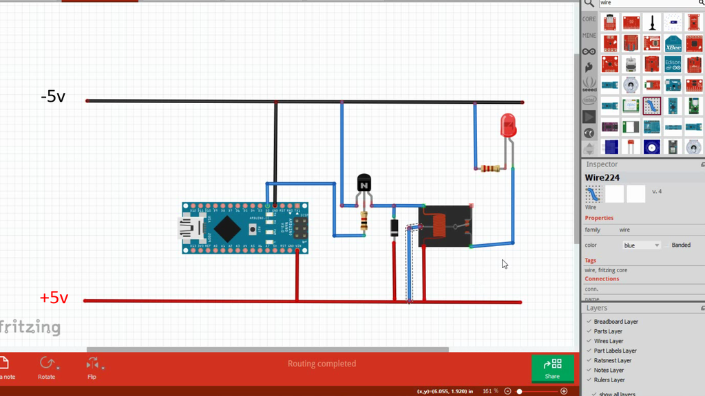

# Driving a Relay 

## Driving a Relay With an Arduino

* https://www.instructables.com/Driving-a-Relay-With-an-Arduino/

## Arduino基础项目（五）：继电器实验

https://blog.csdn.net/2301_81461100/article/details/135237501?spm=1001.2101.3001.6650.2&utm_medium=distribute.pc_relevant.none-task-blog-2%7Edefault%7EYuanLiJiHua%7EPosition-2-135237501-blog-54982107.235%5Ev43%5Econtrol&depth_1-utm_source=distribute.pc_relevant.none-task-blog-2%7Edefault%7EYuanLiJiHua%7EPosition-2-135237501-blog-54982107.235%5Ev43%5Econtrol&utm_relevant_index=5

### 使用继电器模块

### 使用继电器

