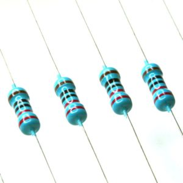

#  电阻元件

## 电阻色环

### 四色环电阻计算：

* 棕1 红2 橙3 黄4 绿5 蓝6 紫7 灰8 白9 黑0 

* 金、银表示误差（金色为5%误差，银色为10%误差）

各色环表示意义如下：

* 第一条色环：阻值的第一位数字；

* 第二条色环：阻值的第二位数字；

* 第三条色环：10的`幂数`；

* 第四条色环：`误差`表示。

例如：电阻色环：
 
 棕  绿  红 金
 
 |  棕  | 绿   | 红(幂)  | 金(误差)|
 |:----:|:----:|:------:|:---:|
 | 1    |5    | 2     | 5% |
 
阻值：15* 10^2= 1500欧 = 1.5千欧 = 1.5K

`220K色环`：红，红 黄 金 

 |  红  | 红   | 黄(幂)  | 金(误差)|
 |:----:|:----:|:------:|:---:|
 | 2    |1    | 1     | 5% |

 
### 五色环电阻计算

第一条色环：阻值的第一位数字； 

第二条色环：阻值的第二位数字； 

第三条色环：阻值的第三位数字； 

第四条色环：阻值乘数的10的幂数； 

第五条色环：误差（常见是棕色，误差为1%）

有些五色环电阻两头金属帽上都有色环，远离相对集中的四道色环的那道色环表示误差，是第 五条色环

与之对应的另一头金属帽上的是第一道色环，读数时从它读起，之后的第二道、第三道色环是次高位、次次高位，第四道环表示10的多少次方

`220五色环`：红，红  黑 黑  棕 

 |  红  | 红    | 黑   |  黑   |  棕 |
 |:----:|:----:|:----:|:-----:|:---:|
 | 2    |2     |  0   |  0    |  1% |

`1K五色环`：棕， 黑  黑  红  棕 

 |  棕  | 黑    | 黑   |  红   |  棕 |
 |:----:|:----:|:----:|:-----:|:---:|
 | 1    | 0     |  0   | 2    |  1% |
 
 `10K五色环`：棕， 黑  黑   橙   棕 

 |  棕  | 黑    | 黑   |  橙    |  棕 |
 |:----:|:----:|:----:|:-----:|:---:|
 | 1    | 0     |  0   | 3    |  1% |
 
 

