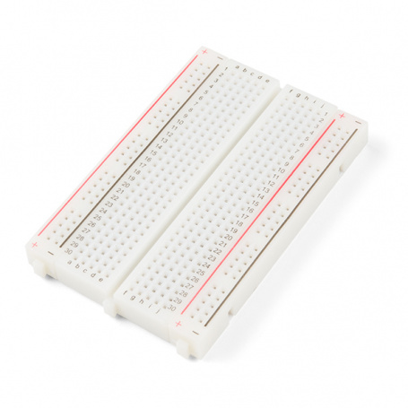
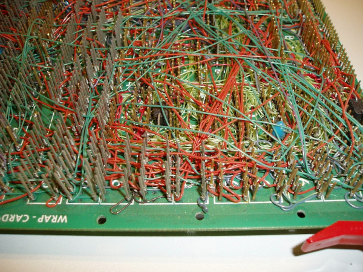
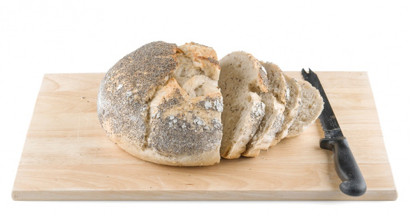
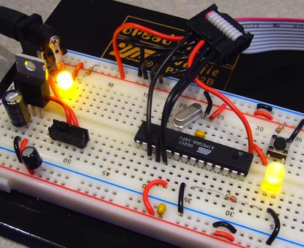
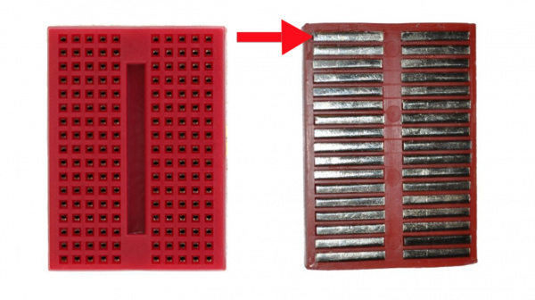

# How to Use a Breadboard

## Introduction

Breadboards are one of the most fundamental pieces when learning how to build circuits. 

In this tutorial, you will learn a little bit about what breadboards are, why they are called breadboards, and how to use one. 

Once you are done you should have a basic understanding of how breadboards work and be able to build a basic circuit on a breadboard.

## History

If you wanted to build a circuit prior to the 1960s, chances are you would have used a technique called wire-wrap. Wire wrap is a process that involves wrapping wires around conductive posts attached to a perfboard (a.k.a. a protoboard). 

As you can see, the process can get rather complex very quickly.

Although this method is still used today, there is something that makes prototyping much easier, breadboards!

### What’s in a Name?
When you picture a breadboard in your head, you may envision a big piece of wood and a large loaf of freshly baked bread. 

You wouldn’t be too far off either.

So why do we call this electronic `“circuit builder”` a breadboard? 

Many years ago, when electronics were big and bulky, people would grab the nearest breadboard, a few nails or thumbtacks, and start connecting wires onto the board to give themselves a platform on which to build their circuits.

Since then, electronic components have gotten a lot smaller, and we’ve come up with better ways to connect circuits, making people all over the world happy to have their breadboards back. However, we are stuck with the confusing name. Technically, these are still breadboards, but this discussion is going to be on modern, "solderless" breadboards.

## Why Use Breadboards?

An electronics breadboard (as opposed to the type on which sandwiches are made) is actually referring to a **solderless breadboard**. These are great units for making temporary circuits and prototyping, and they require absolutely no soldering.

`Prototyping` is the process of testing out an idea by creating a preliminary model from which other forms are developed or copied, and it is one of the most common uses for breadboards. If you aren’t sure how a circuit will react under a given set of parameters, it’s best to build a prototype and test it out.

For those new to electronics and circuits, breadboards are often the best place to start. That is the real beauty of breadboards--they can house both the simplest circuit as well as very complex circuits. As you'll see later in this tutorial, if your circuit outgrows its current breadboard, others can be be attached to accommodate circuits of all sizes and complexities.

Another common use of breadboards is testing out new parts, such as Integrated circuits (ICs). When you are trying to figure out how a part works and constantly rewiring things, you don’t want to have to solder your connections each time.

As mentioned, you don’t always want the circuit you build to be permanent. When trying to duplicate a customer’s problem, SparkFun’s Technical Support team will often use breadboards to build, test, and analyze the circuit. They can connect the parts the customer has, and once they’ve gotten the circuit setup and figured out the problem, they can take everything apart and put it aside for the next time they need to do some troubleshooting.

## Anatomy of a Breadboard

The best way to explain how a breadboard works is to take it apart and see what’s inside.

Using a smaller breadboard it’s easier to see just how they function.

The tops of the metal rows have little clips that hide under the plastic holes. Each metal strip and socket is spaced with a standard pitch of 0.1" (2.54mm). These clips allow you to stick a wire or the leg of a component into the exposed holes on a breadboard, which then hold it in place.

Once inserted that component will be electrically connected to anything else placed in that row. This is because the metal rows are conductive and allow current to flow from any point in that strip. 

Notice that there are only `five` clips on this strip. This is typical on almost all breadboards. Thus, you can only have up to five components connected in one particular section of the breadboard. The row has ten holes, so why can you only connect five components? 

You’ll also notice that each horizontal row is separated by a ravine, or crevasse, in the middle of the breadboard. This ravine isolates both sides of a given row from one another, and they are not electrically connected. We’ll discuss the purpose of this in just a bit, but, for now, just know that each side of a given row is disconnected from the other, leaving you with five spots for components on either side.

### Power Rails

Now that we’ve seen how the connections in a breadboard are made, let’s look at a larger, more typical breadboard. Aside from horizontal rows, breadboards usually have what are called power rails that run `vertically` along the side

These power rails are metal strips that are identical to the ones that run horizontally, except they are, typically*, all connected. When building a circuit, you tend to need power in lots of different places. The power rails give you lots of easy access to power wherever you need it in your circuit. Usually they will be labeled with a `‘+’` and a `‘-’` and have a `red` and `blue` or `black` stripe, to indicate the positive and negative side.

### DIP Support

Earlier we mentioned the ravine that isolates the two sides of a breadboard. This ravine serves a very important purpose. Many `integrated circuits`, often referred to as ICs or, simply, chips, are manufactured specifically to fit onto breadboards. In order to minimize the amount of space they take up on the breadboard, they come in what is known as a `Dual in-line Package(双列直插封装)`, or `DIP`.

These DIP chips (salsa anyone?) have legs that come out of both sides and fit perfectly over that ravine. Since each leg on the IC is unique, we don’t want both sides to be connected to each other. That is where the separation in the middle of the board comes in handy. Thus, we can connect components to each side of the IC without interfering with the functionality of the leg on the opposite side

## Reference

1. https://learn.sparkfun.com/tutorials/how-to-use-a-breadboard/all

2. https://www.instructables.com/Use-a-real-Bread-Board-for-prototyping-your-circui/

